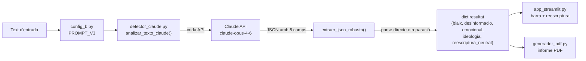

# Blueprint tècnic: Orientació ideològica i reescriptura neutral

**Sistema B (Claude API) — Treball de Recerca 2026**
**Autora:** Arantxa Ruiz-Ruano Pedreira
**Data d'aquest document:** 3 d'agost de 2026

---

## 1. Resum

Aquesta funcionalitat afegeix un quart eix d'anàlisi al Sistema B, més enllà de les tres dimensions originals (biaix, desinformació, llenguatge emocional): la **orientació ideològica** (esquerra-dreta) del text. A més, com a "solució" davant d'un text esbiaixat, el sistema genera automàticament una **reescriptura neutral** del mateix contingut.

A la interfície, l'orientació es mostra com una barra horitzontal esquerra↔dreta amb un marcador (una "gota") que indica on se situa el text. Al comparar dues notícies, totes dues es representen amb un marcador de color diferent sobre la mateixa barra. La reescriptura neutral es mostra com a text copiable, i tot plegat s'inclou també als informes PDF.

---

## 2. Per què s'ha afegit

La pregunta de recerca original tracta la detecció de biaix ideològic, llenguatge emocional i desinformació. Afegir un eix explícit esquerra-dreta converteix el senyal qualitatiu de "biaix" en una magnitud quantificable i visual, i complementa la detecció amb una resposta pràctica: en lloc de només assenyalar el problema, el sistema proposa com explicar el mateix fet de manera objectiva.

**Nota metodològica:** aquest eix és una dimensió nova, afegida després del disseny original de la rúbrica (biaix / desinformació / emocional). A diferència d'aquestes tres, encara no té una validació independent (per exemple, contra l'avaluadora experta) — val la pena tenir-ho en compte si es vol incloure a la comparativa Sistema A vs. Sistema B vs. expert.

---

## 3. Arquitectura i flux de dades



---

## 4. Esquema de dades

Cada anàlisi retorna ara aquest diccionari (dues claus noves respecte a la versió original, en negreta):

```json
{
  "biaix": {
    "intensitat": "nul·la|lleu|moderada|alta",
    "fragment": "cita literal",
    "explicacio": "2-3 frases",
    "confianca": 0
  },
  "desinformacio": { "...": "..." },
  "emocional": { "...": "..." },
  "ideologia": {
    "puntuacio": -100,
    "etiqueta": "esquerra|centre-esquerra|centre|centre-dreta|dreta",
    "explicacio": "quins temes, marcs o postures justifiquen la puntuació"
  },
  "reescriptura_neutral": "versió reescrita del text, factual i sense biaix"
}
```

---

## 5. Escala ideològica

Definida a `config_b.py`, dins del prompt (`PROMPT_V3`):

| Rang | Etiqueta | Criteri |
|---|---|---|
| -100 a -60 | Esquerra | Intervenció estatal forta, redistribució, crítica al capitalisme, moviments obrers/feministes/ecologistes |
| -60 a -20 | Centre-esquerra | Socialdemocràcia, regulació moderada, estat del benestar |
| -20 a 20 | Centre | Posicions equilibrades o text purament factual, sense marcadors ideològics clars |
| 20 a 60 | Centre-dreta | Liberalisme econòmic moderat, èmfasi en l'ordre i la responsabilitat individual |
| 60 a 100 | Dreta | Nacionalisme, liberalisme econòmic fort, conservadorisme social |

El prompt indica explícitament al model que es basi **només** en el contingut i el framing del text, mai en suposicions sobre l'autor o el mitjà.

---

## 6. Canvis per fitxer

### `config_b.py`
- Bloc nou al prompt: **ORIENTACIÓ IDEOLÒGICA** (escala -100/+100 amb guia orientativa) i **REESCRIPTURA NEUTRAL** (instruccions per generar la versió alternativa).
- Constant nova: `ETIQUETES_IDEOLOGIA`.
- `MAX_TOKENS`: 1024 → 4096 → **8192**. Calia pujar-lo perquè la resposta ara inclou 4 explicacions més una reescriptura completa del text, i amb 1024 la resposta es tallava a mig JSON.

### `detector_claude.py`
- `extraer_json_robusto()`: els tres camins de fallback (reconstrucció per regex, anàlisi superficial, fallback final) ara també omplen `ideologia` i `reescriptura_neutral` amb valors per defecte, perquè mai faltin aquestes claus.
- **Nou:** `_reparar_json_truncat()` — pas afegit entre l'intent 3 i el 4. Quan la resposta es talla a mig JSON (típicament a mitja `reescriptura_neutral`, per ser el camp més llarg i l'últim), en lloc de descartar el camp incomplet, el tanca conservant el text parcial (marcat amb `"... [TALLAT]"`) i equilibra claus/claudàtors.
- `analizar_texto_claude()`: backfill final que garanteix `ideologia` i `reescriptura_neutral` sempre presents, sigui quin sigui el camí de parseig que s'hagi fet servir.

### `app_streamlit.py`
- `mostrar_barra_ideologia(data)`: barra HTML/CSS amb gradient blau (esquerra) → gris (centre) → vermell (dreta) i un marcador circular. Etiquetes "Esquerra / Centre / Dreta" i l'explicació de la rúbrica a sota.
- `mostrar_barra_ideologia_comparativa(data1, data2)`: mateixa barra, però amb **dos** marcadors (rosa per a Notícia 1, gris per a Notícia 2), lleugerament desplaçats en alçada perquè no es tapin si les puntuacions són properes, amb llegenda de colors inline.
- `mostrar_reescriptura_neutral(data)`: mostra el text alternatiu amb `st.code()` (text nítid, botó de copiar integrat — es va canviar des d'un `text_area` deshabilitat, que sortia gris i no es podia seleccionar). Si el camp és buit (per truncament), mostra un avís explicatiu en lloc d'una secció buida.
- Connectat a la Pestanya 1 (anàlisi simple) i a la Pestanya 2 (comparació de notícies).

### `generador_pdf.py`
- `crear_grafic_ideologia(data)`: gràfic matplotlib amb la mateixa barra de gradient i un marcador, per a l'informe individual.
- `crear_grafic_ideologia_comparatiu(data1, data2)`: mateixa barra amb dos marcadors (rosa/gris), **sense** llegenda de matplotlib — es va treure perquè els seus símbols es confonien amb els marcadors reals i semblava que hi havia 4 punts en lloc de 2. El nom de cada notícia amb el seu punt de color es dibuixa directament al text del PDF (`pdf.ellipse(...)`).
- Correcció d'alineació dels textos "Esquerra"/"Dreta" (`ha='left'`/`ha='right'`) perquè no quedessin tallats a la vora de la imatge.
- Connectat a `generar_pdf()` i `generar_pdf_comparatiu()`, incloent-hi la reescriptura neutral de cada notícia.

---

## 7. Comportament conegut i pendents

- **Variabilitat entre execucions idèntiques:** la crida a l'API no fixa `temperature`, així que per defecte és 1.0 (màxima aleatorietat permesa). Amb el mateix text pot sortir una intensitat o puntuació lleugerament diferent d'una execució a una altra, sobretot en casos límit. Pendent de decidir si es baixa la temperature per a resultats més reproduïbles (rellevant per a la validesa metodològica del TR).
- **La reescriptura neutral la genera el mateix model que fa la detecció** (Sistema B / Claude), no una font externa independent. La idea original considerava també recomanar notícies o tuits reals que expliquessin el fet de manera objectiva; això no s'ha implementat (requeriria una font de cerca externa) i queda com a possible ampliació.
- **L'eix ideològic no té encara validació independent**, a diferència de les tres dimensions originals (que sí tenen previst el contrast amb el dossier expert).

---

## 8. Fitxers modificats (resum)

| Fitxer | Canvi principal |
|---|---|
| `config_b.py` | Rúbrica ideològica + reescriptura al prompt; `MAX_TOKENS` 1024→8192 |
| `detector_claude.py` | Fallbacks robustos + reparació de JSON truncat |
| `app_streamlit.py` | Barra (simple i comparativa) + reescriptura a la interfície |
| `generador_pdf.py` | Gràfics d'ideologia + reescriptura als informes PDF |
